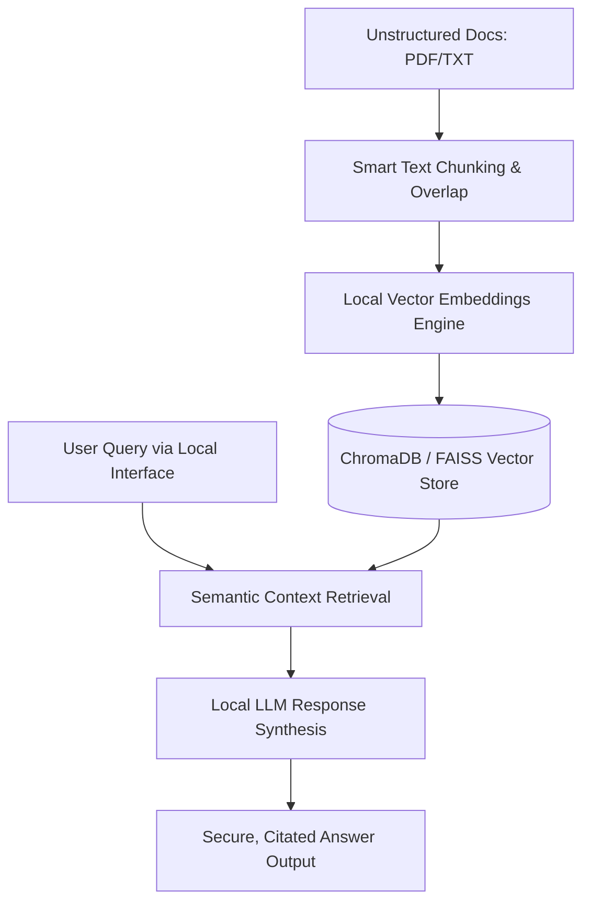

# Local-DocuBrain RAG Engine 🧠🤖

An enterprise-grade, local Retrieval-Augmented Generation (RAG) system built to parse, process, index, and query massive unstructured document ecosystems. This application is architected to run completely offline on local infrastructure to guarantee zero data leaks, corporate privacy, and strict intellectual property protection.

---

## 🏗️ System Architecture & Workflow



---

## 📌 Core Features

* **Strict On-Premises Privacy**: 100% data control with zero external cloud API usage.
* **Intelligent Document Parsing**: Automated content parsing, semantic cleaning, and sliding-window chunking.
* **High-Speed Vector Search**: Instant lookup of deep semantic relationships utilizing high-density local vector stores.
* **Context-Aware Synthesis**: Limits LLM hallucinations by injecting highly relevant source documents explicitly into the prompt context window.

---

## 🛠️ Technical Stack

* **Language Platform**: Python 3.10+
* **Orchestration Framework**: LangChain / LlamaIndex
* **Storage Platform**: ChromaDB / FAISS (Vector Database)
* **Embedding Model Ecosystem**: Hugging Face Transformers (e.g., `all-MiniLM-L6-v2`)
* **Local Inference Runtime**: Ollama / Llama.cpp (Running local models like Llama 3 or Mistral)

---

## 🚀 Quick Setup & Local Execution

### 1. Prerequisite Installations
Ensure you have Python installed and your local LLM engine active (e.g., Ollama running locally).

### 2. Environment Configurations
Clone this repository and set up a virtual ecosystem environment:
```bash
# Clone the repository
git clone https://github.com
cd Local-DocuBrain-RAG-Engine

# Initialize and activate virtual environment
python -m venv venv
source venv/bin/activate  # On Windows use: venv\Scripts\activate

# Install production dependencies
pip install -r requirements.txt
```

### 3. Initialize Ingestion & Processing Pipeline
Place your target analysis files (PDFs, Markdown, text files) directly into the raw source data directory (e.g., `/docs`), then run the vectorized building pipeline:
```bash
python ingest.py
```

### 4. Query the System Interface
Execute the semantic pipeline engine loop to interact live with your secure localized document corpus:
```bash
python query.py --prompt "What are the Q3 target compliance metrics mentioned in the file?"
```

---

## 📊 Evaluation & Verification Parameters
* **Chunk Strategy**: 500-character chunk sizes containing a 50-character overlap window to preserve document paragraph context.
* **Retrieval Mode**: Top-k similarity metrics (\(k=3\)) using Cosine Distance calculations to extract optimal semantic data blocks.
