# 🧠 Local-DocuBrain-RAG-Engine

An enterprise-grade, locally isolated Retrieval-Augmented Generation (RAG) engine. This system allows you to chat with complex local documentation, source files, and knowledge bases with absolute data privacy. It operates 100% offline using an optimized ingestion pipeline and local LLM inference models.

---

## 🎯 System Capabilities & Architecture
* **Zero-Leak Data Privacy**: Designed for enterprise security boundaries. No data ever leaves your local environment (`fresh_venv`).
* **Optimized Ingestion Pipeline**: Implements advanced structural text splitting and high-fidelity embedding generation for dense vector mapping.
* **Deterministic Local Retrieval**: Uses a vectorized semantic search layer to inject hyper-relevant context windows directly into local LLM completion prompts.

---

## ⚙️ Core Data Workflow

```mermaid
graph TD
    A[Raw Source Docs/PDFs] --> B(Recursive Text Splitter)
    B --> C(Local Embedding Engine)
    C --> D[Vector Store DB Index]
    E[User Query] --> F(Semantic Similarity Search)
    D --> F
    F -->|Context-Infused Prompt| G[Local Ollama Daemon]
    G --> H[Precise Deterministic Answer]

    style B fill:#2a2a2a,stroke:#4f46e5,stroke-width:2px;
    style D fill:#1e1b4b,stroke:#818cf8,stroke-width:2px;
    style H fill:#064e3b,stroke:#34d399,stroke-width:2px;
```



---

## 🚀 Environment Initialization & Setup

### 1. Prerequisites
* **Operating System**: Windows 11 (PowerShell Runtime)
* **Python Engine**: Python 3.10+
* **Local LLM Engine**: Installed and running [Ollama Engine](https://ollama.com)

### 2. Sandbox Setup & Virtual Environment Isolation
```powershell
# Clone the repository
git clone https://github.com
cd Local-DocuBrain-RAG-Engine

# Initialize the workspace isolated environment
python -m venv fresh_venv
.\fresh_venv\Scripts\Activate.ps1

# Upgrade foundational package wheels
python -m pip install --upgrade pip setuptools wheel
```

### 3. Dependency Deployment
Install the core NLP parsing frameworks and vector engines:
```powershell
pip install -r requirements.txt
```

---

## 🛠️ Ingestion & Execution Workflow

### Step 1: Pre-load the Vector Data Store
Place your targets inside the local data repository directory and run the data extraction layer:
```powershell
python ingest.py
```

### Step 2: Query the RAG Brain
Engage the continuous terminal orchestration loop to run inference on your documents:
```powershell
python query.py
```

---

## 📁 Repository Directory Matrix

```text
Local-DocuBrain-RAG-Engine/
├── fresh_venv/               # Isolated Local Virtual Environment (Ignored)
├── data/                     # Raw Context Documents (PDF, TXT, MD)
├── db/                       # Localized Persistent Vector Index Files
├── core/
│   ├── __init__.py           # Package Init
│   ├── embedder.py           # Text Processing & Vector Mapping Logic
│   └── llm_handler.py        # Ollama Inference Interfacing Layer
├── .gitignore                # Absolute Local Isolation Matrix
├── ingest.py                 # File Tokenization & Vector Database Ingestion Layer
├── query.py                  # CLI Question-Answering Orchestration Entrypoint
└── README.md                 # System Overview Documentation
```

---

## 🔐 Security & Engineering Hygiene
The `.gitignore` engine strictly blocks the indexing of local vector binaries (`db/`), untracked documents (`data/`), and environment dependencies (`fresh_venv/`). This eliminates any accidental enterprise data exposure during collaborative workspace pushes.
