# 🧠 Local-DocuBrain-RAG-Engine

An enterprise-grade, memory-optimized Retrieval-Augmented Generation (RAG) engine designed to chat with complex local documentation. Powered 100% locally and offline by **Ollama (Phi-3 & Nomic-Embed-Text)** using the **LlamaIndex** framework, this architecture guarantees absolute data privacy within an isolated local system environment.

---

## 🎯 Engineering Highlights & Capabilities
* **Persistent Vector Indexing**: Computes mathematical document embeddings once and caches the indices to disk (`db/`). Future applications boot instantly with zero CPU overhead.
* **Bounded Context Windows**: Hard-restricts model context loops to `2048 tokens` to prevent system memory overload or massive RAM allocations during long generation passes.
* **Deterministic Local Grounding**: Integrates strict prompt injection to force the model to answer questions using only localized facts, completely eliminating hallucinations.

---

## ⚙️ Core System Architecture

```mermaid
graph TD
    A[Raw Source Documents] --> B(SimpleDirectoryReader)
    B --> C(OllamaEmbedding: nomic-embed-text)
    C --> D[Persistent Storage Cache: /db]
    E[User Query] --> F(LlamaIndex Retrieval Node)
    D --> F
    F -->|Bounded Context Window| G[Local Ollama Daemon: phi3]
    G --> H[Deterministic Answer Output]

    style C fill:#2a2a2a,stroke:#4f46e5,stroke-width:2px;
    style D fill:#1e1b4b,stroke:#818cf8,stroke-width:2px;
    style H fill:#064e3b,stroke:#34d399,stroke-width:2px;
```



---

## 🚀 Local Environment Initialization & Setup

### 1. Prerequisites
* **Operating System**: Windows 11 (PowerShell Isolation)
* **Python Runtime**: Python 3.10+
* **Local Inference Daemon**: [Ollama Runtime Engine](https://ollama.com) active with models pre-pulled:
  ```powershell
  ollama pull phi3
  ollama pull nomic-embed-text
  ```

### 2. Sandbox Setup & Virtual Environment Isolation
```powershell
# Navigate to project root folder
cd "F:\Local AI Library"

# Initialize and activate isolated workspace
python -m venv fresh_venv
.\fresh_venv\Scripts\Activate.ps1
```

### 3. Production Framework Installation
```powershell
pip install llama-index llama-index-llms-ollama llama-index-embeddings-ollama pypdf
```

---

## 🛠️ Execution Specification
Drop target document assets (PDF, TXT, or MD format) directly into your local `documents/` directory and execute the primary runtime orchestration file:
```powershell
python app.py
```
On its first run, the framework builds the vector index from scratch. Subsequent boots read instantly from the local cached `db/` block.

---

## 📁 Repository Directory Matrix

```text
Local-DocuBrain-RAG-Engine/
├── fresh_venv/               # Isolated Local Virtual Environment (Ignored)
├── db/                       # Persistent Vector Database Indices (Ignored Cache)
├── documents/                # Target ingestion directory for source context files
├── .gitignore                # Production Isolation and Safety Tracking Matrix
├── app.py                    # Core Unified LlamaIndex RAG Orchestration Engine
└── README.md                 # System Overview & Architecture Documentation
```

---

## 🔐 Security & Data Isolation
The project's `.gitignore` asset completely isolates heavy background environment binaries (`fresh_venv/`), local database binaries (`db/`), and unindexed raw data files. This structure allows seamless team collaboration while ensuring private assets remain 100% confidential.
